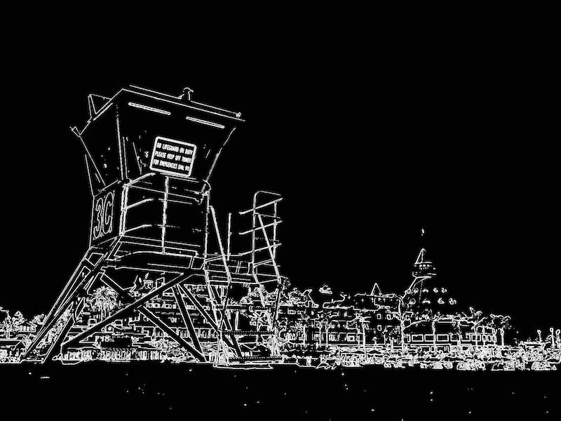

```{r, include = FALSE}
knitr::opts_chunk$set(
  collapse = TRUE,
  comment = "#>"
)
```

This document introduces you to Rmagine's image filter functions, and shows you how to apply them to images. 

Here's an example photo we'll be using taken at Coronado Beach, San Diego:


### Using the Tunnel Filter

This function produces an image with strong visual distortion intended to create a tunnel or pincushion effect.

```r
library(Rmagine)
tunnel_filter(image_path, rot)
```

#### Arguments

- `image_path`: file path of the input image (string)
- `rot`: rotation degree holding value between -0.5 and 0.5 (float, optional). If not specified, defaults to 0.5

#### Output

- Saves the image with tunnel filter applied to the current working directory

#### Example

- `tunnel_filter("imgs/coronado_beach.jpeg", -0.2)`


### Using Colour Filters

This function produces an image with different user-specified colour distortions.

```r
library(Rmagine)
colour_filters(image, tone)
```

#### Arguments

- `image`: file path of the input image (string)
- `tone`: colour filter to be applied to the image (string, optional) 'grayscale', 'red_tone', 'green_tone', 'blue_tone', 'negative'. If not specified, defaults to 'grayscale'

#### Output

- Saves the image with colour filter applied to the current working directory

#### Example

- `colour_filters("imgs/coronado_beach.jpeg", 'blue_tone')`


### Using the Edge Detection Filter

This function identifies edges by looking at where the image brightness changes sharply, and produces a black and white image highlighting the locations of these edges.

```r
library(Rmagine)
edge_detection(image_path)
```

#### Arguments

- `image_path`: file path of the input image (string)

#### Output

- Saves the image with edge detection filter applied to the current working directory

#### Example

- `edge_detection("imgs/coronado_beach.jpeg")`


### Using the Vignetting Filter

This function produces an image with reduced brightness around the periphery compared to the image center.

```r
library(Rmagine)
vignette_filter(image_path, strength)
```

#### Arguments

- `image_path`: file path of the input image (string)
- `strength`: parameter for strength of the dimming effect (double, optional). If not specified, defaults to 1.0

#### Output

- Saves the image with vignetting applied at specified strength to the current working directory

#### Example

- `vignette_filter("imgs/coronado_beach.jpeg", 1.0)`

